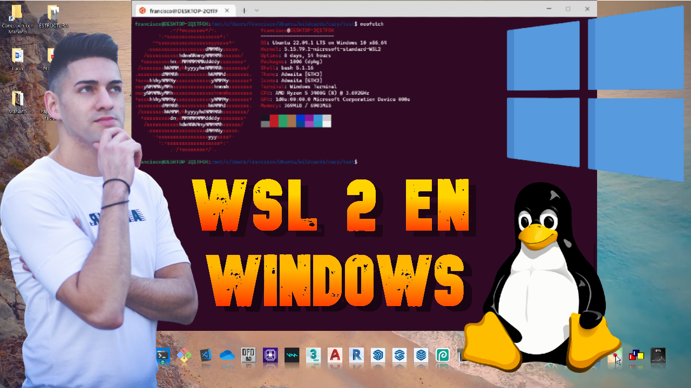
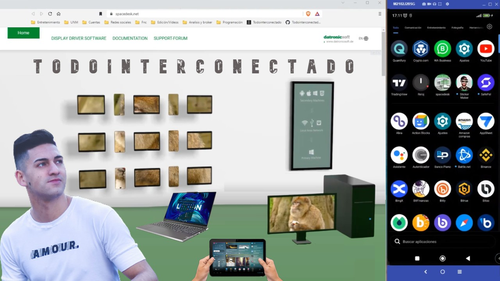
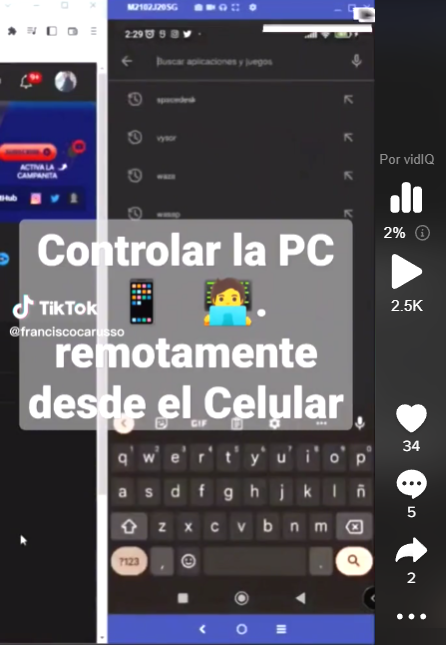
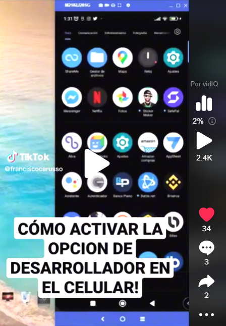
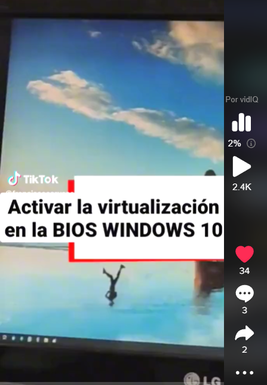

<p align="center" width="300">
    
    <h2 align="center">¡Hey 👋! Soy Francisco Carusso 👨🏻‍💻</h2>
</p>

```javascript
    let saludos = [
        '     Soy un apasionado del Frontend',
        'Desarrolle la comunidad @todointerconectado',
        '        ¡Revisa mi contenido 👇!'           ];

    for(let saludo of saludos) {
        console.log(saludo);
    }
```

<p align="center" style="display: flex; justify-content: center; gap: 10px;">
    <a href="https://todointerconectado.com" target="_blank">
        </a>
    <a href="https://www.linkedin.com/in/franciscocarusso/" target="_blank">
        </a>
    <a href="https://www.youtube.com/@todointerconectado" target="_blank">
        </a>
    <a href="https://www.tiktok.com/@todointerconectado" target="_blank">
        </a>
    <a href="https://instagram.com/franciscocarusso" target="_blank">
        </a></p>

<hr>

<h3 align="left">💬 Languages and Tools:</h3>
<p align="left" style="display: flex; gap: 20px">
    <a href="https://www.cprogramming.com/" target="_blank" rel="noreferrer"> </a>
    <a href="https://www.w3.org/html/" target="_blank" rel="noreferrer"> </a>
    <a href="https://www.w3schools.com/css/" target="_blank" rel="noreferrer"> </a>
    <a href="https://developer.mozilla.org/en-US/docs/Web/JavaScript" target="_blank" rel="noreferrer"> </a>
    <a href="https://git-scm.com/" target="_blank" rel="noreferrer"> </a>
    <a href="https://sass-lang.com" target="_blank" rel="noreferrer"> </a>
    <a href="https://getbootstrap.com" target="_blank" rel="noreferrer"> </a>
    <a href="https://reactjs.org/" target="_blank" rel="noreferrer"> </a>
</p>

### 📹 Últimos vídeos en mi [canal de Youtube](https://youtube.com/@todointerconectado)

<a href='https://www.youtube.com/watch?v=LeaKOlriVCk&t=1055s' target='_blank'>
    </a>
<a href='https://www.youtube.com/watch?v=VGONJt-d2Q4&t=4s' target='_blank'>
    </a>

<br>

### 📹 Últimos vídeos en mi [canal de TikTok](https://tiktok.com/@todointerconectado)
    
<a href='https://vm.tiktok.com/ZMYfUF9hT/' target='_blank'>
    </a>
<a href='https://vm.tiktok.com/ZMYfU8hLq/' target='_blank'>
    </a>
<a href='https://vm.tiktok.com/ZMYfUUmnf/' target='_blank'>
    </a>

### 📈 Estadisticas de los lenguages más usados

<p>
    </p>

